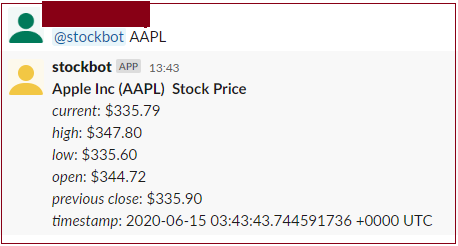

# Simple Slack bot in Go using event API
## Stock bot

 

In this application, we will discuss about `stockbot` that returns stock prices of a company. 
 The architecture is as follows.
 
  
 
  For one who comes to this repository first, I have another repository call [`weatherbot`](https://github.com/Tracey7d4/weatherbot) in which I have described step by step how to build a `weatherbot` for querying weather conditon of a location. Most of the steps of implementation for two bots are similar, including building a Slack bot user, subscribing to app mentioned event, creating a Go function which is a HTTP handler. So please refer to that application for more details. In this application, I only discuss the difference in Go function. In particular, we will have a look at `getStock()`, which is used to make a call out to third-party API, receive the response, extract and format the information.
   
 The `getQuote()` is as follows.

```go
    func getQuote(sym string) (string, error) {
    	sym = strings.ToUpper(sym)
    
    	fhUrl := fmt.Sprintf("https://finnhub.io/api/v1/quote?symbol=%s", sym)
    	resp, err := http.Get(fhUrl)
    	if err != nil {
    		return "", err
    	}
    
    	defer func(){
    		_ = resp.Body.Close()
    	}()
    
    	body, err := ioutil.ReadAll(resp.Body)
    	m := make(map[string]float32)
    	err = json.Unmarshal(body, &m)
    	if err != nil {
    		return "", err
    	}
    
    	fhUrlForName := fmt.Sprintf("https://finnhub.io/api/v1/stock/profile2?symbol=%s", sym)
    	resp, err = http.Get(fhUrlForName)
    	if err != nil {
    		return "", err
    	}
    
    	defer func(){
    		_ = resp.Body.Close()
    	}()
    
    	body, err = ioutil.ReadAll(resp.Body)
    	m1 := make(map[string]string)
    	err = json.Unmarshal(body, &m1)
    	if err != nil {
    		return "", err
    	}
    
    	var s string
    
    	if len(m) == 1 {
    		s = "_" + sym + " is not a valid trading name_"
    	} else {
    		s = "*" + m1["name"] + " (" + sym + ") " + " Stock Price* \n" +
    			"_current_: $" + fmt.Sprintf("%.2f", m["c"]) + "\n" +
    			"_high_: $" + fmt.Sprintf("%.2f", m["h"]) + "\n" +
    			"_low_: $" + fmt.Sprintf("%.2f", m["l"]) + "\n" +
    			"_open_: $" + fmt.Sprintf("%.2f", m["o"]) + "\n" +
    			"_previous close_: $" + fmt.Sprintf("%.2f", m["pc"]) + "\n" +
    			"_timestamp_: " + time.Now().UTC().String()
    	}
    
    	return s, nil
    }
```
  
  I use `http://finnhub.io API` this time for getting stock value of a company by its ticker symbol. You can find its API documentation in [here](https://finnhub.io/docs/api). 
  
  I also want to display the company trading name along with its ticker symbol, so I make another call 
  for getting the company name.
  
   ```shell script
   https://finnhub.io/api/v1/stock/profile2?symbol=<ticker symbol>
   ```
   
   Now let's deploy our `Go` function
   
   ```shell script
   gcloud functions deploy AppStockMentionHandler --runtime go111 --trigger-http
   ```
   When you see that your function has been successfully deployed, go to a Slack Channel and call your bot, remember to
   mention its name.
   
   ```shell script
   @stockbot aapl
   ```  
   
   
   
   Hope you enjoy your bots.

### API reference
* [Stock API Documentation](https://finnhub.io/docs/api)
* [Weather bot repository](https://github.com/Tracey7d4/weatherbot)